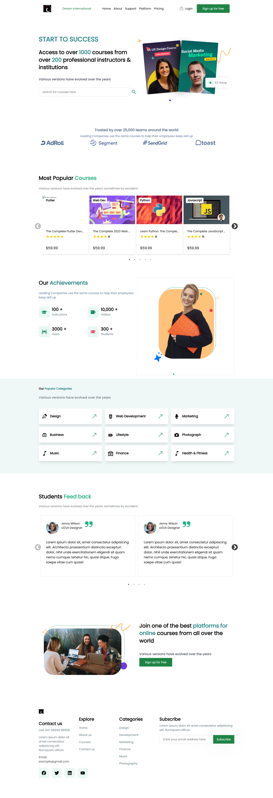

# Tailwind React Landing Page

This repository contains a responsive landing page template built using React, Tailwind CSS, and Vite. 
## Features

- **Responsive Design:** Ensures compatibility across various devices and screen sizes.
- **Sleek UI:** A modern and intuitive user interface to highlight educational offerings.
- **Vite for Efficient Development:** Utilizes Vite for a rapid development experience.

## Installation

1. Clone this repository:

   ```bash
   git clone https://github.com/Vivek7548/Vivek-Task-Dream-International.git
   ```

2. Navigate into the project directory:

   ```bash
   cd tailwind-react-landing
   ```

3. Install dependencies:

   ```bash
   npm install
   ```

## Usage

To start the development server:

```bash
npm run dev
```

## Technologies Used

- **React:** A JavaScript library for building user interfaces.
- **Tailwind CSS:** A utility-first CSS framework for designing responsive web pages.
- **Vite:** A next-generation frontend tooling to streamline development.
- **NPM:** Package manager for Node.js packages.


🚀 Dream International Task

👨‍💻 Author: Vivek Deshmukh
🛠 Tech Stack: React, Vite, Tailwind CSS, JavaScript, HTML, CSS

⏱ Estimated Hours

3 hours (includes setup and deployment)

📦 Installation Guide
# 1. Clone the repository
git clone https://github.com/Vivek7548/Vivek-Task-Dream-International.git

# 2. Navigate to project directory
cd tailwind-react-landing

# 3. Install dependencies
npm install

▶️ Usage Guide

Run the development server:

npm run dev

🌍 Deployment

✅ Live Demo: Dream International Landing Page https://landing-page-task-vivek.netlify.app/


## 📸 Screenshot




